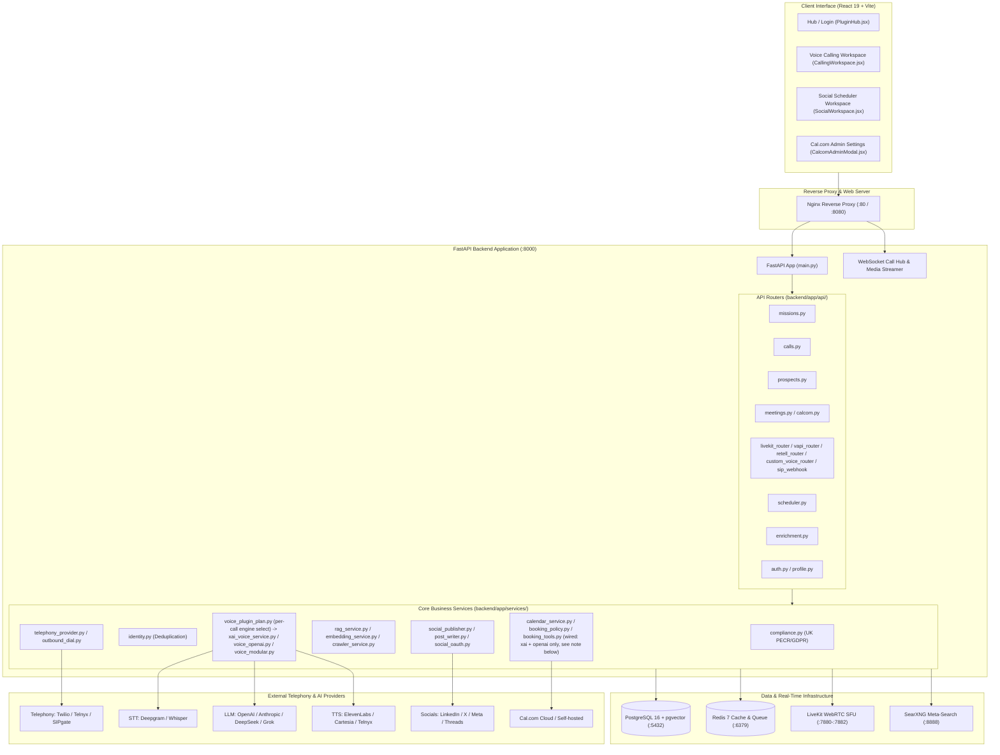
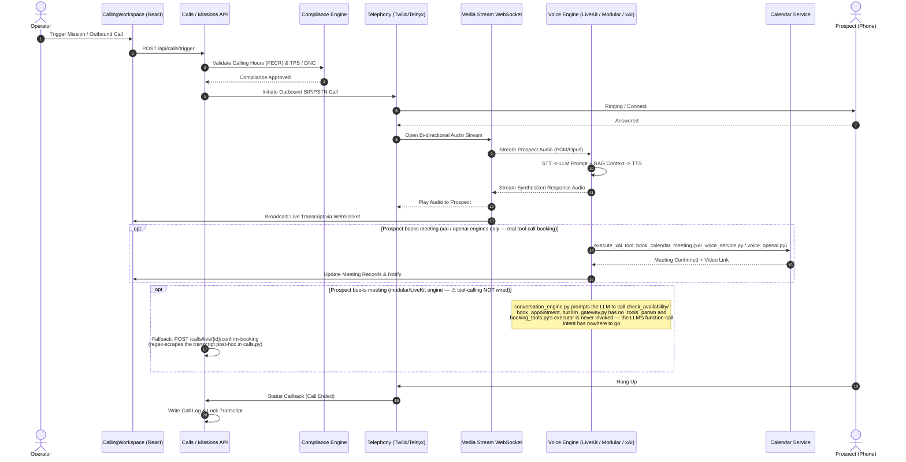
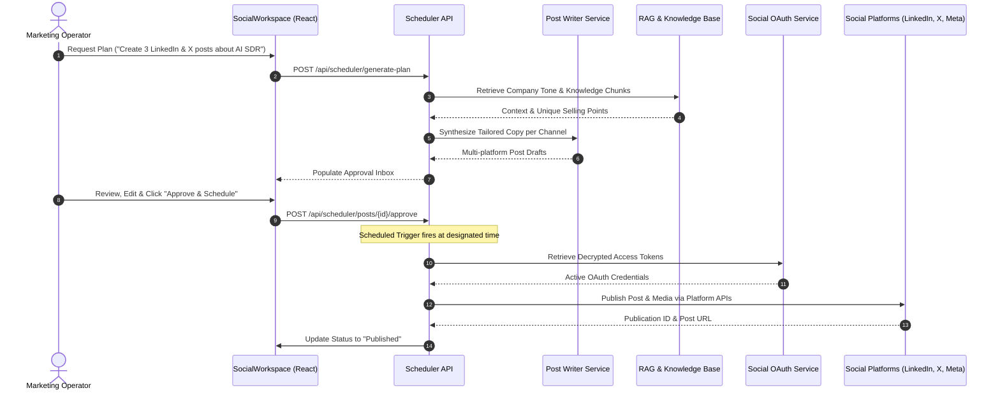
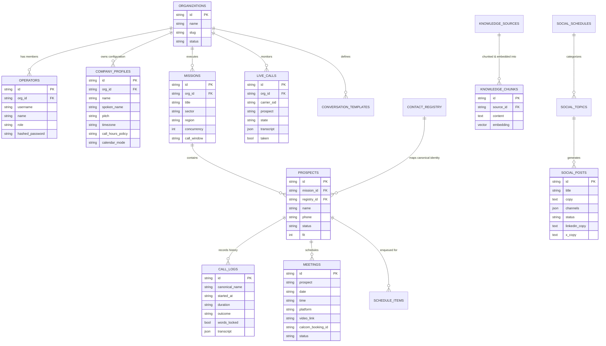

# 🌐 Repository Graph: AIVHub Voice AI Agent & Social Scheduler

**Root Directory:** `C:\Users\aivhu\OneDrive - aivhub.com\Desktop\Voice_AI_agent`  
**Architecture:** Multi-container Full-Stack SaaS (FastAPI + React 19 + PostgreSQL/pgvector + Redis + LiveKit SFU + SearXNG)

---

## 1. High-Level System Architecture



---

## 2. Directory Structure & File Map

```
Voice_AI_agent/
├── docker-compose.yml                      # Multi-service container orchestration
├── docker-compose.override.yml             # Local overrides & developer mounts
├── livekit.yaml                            # Self-hosted LiveKit SFU configuration
├── README.md                               # Project documentation & setup guides
│
├── backend/                                # FastAPI Application Core
│   ├── Dockerfile                          # Python 3.11 container definition
│   ├── requirements.txt                    # Backend dependencies (FastAPI, SQLAlchemy, asyncpg, etc.)
│   └── app/
│       ├── main.py                         # Application entrypoint, lifespan migrations & router mounting
│       ├── config.py                       # Pydantic Settings & environment variables
│       ├── database.py                     # Async SQLAlchemy engine & session factory
│       ├── seed_data.py                    # Database bootstrapping & default seed records
│       │
│       ├── models/                         # SQLAlchemy ORM Models
│       │   └── models.py                   # Data schemas (Organizations, Missions, Calls, Meetings, etc.)
│       │
│       ├── schemas/                        # Pydantic request/response schemas
│       │
│       ├── api/                            # REST API Endpoint Routers
│       │   ├── auth.py                     # User authentication & JWT session management
│       │   ├── missions.py                 # Campaign creation, CSV ingestion & batch control
│       │   ├── prospects.py                # Contact list management & lead statuses
│       │   ├── calls.py                    # Outbound dial triggers, call controls, Twilio webhooks
│       │   │                               #   & transcript-regex booking fallback (confirm-booking)
│       │   ├── meetings.py                 # Meeting briefings, conversions & outcomes
│       │   ├── calcom.py                   # Cal.com v2 integration, webhook receiver & slot discovery
│       │   ├── schedule.py                 # Call queue scheduling & honored callbacks
│       │   ├── conversation_templates.py   # Dynamic script & objection template management
│       │   ├── connections.py              # Third-party provider credentials & key validation
│       │   ├── custom_voice_router.py      # Custom modular STT/LLM/TTS stack orchestration
│       │   ├── livekit_router.py           # WebRTC room token generation & SIP trunking
│       │   ├── vapi_router.py              # Vapi voice engine webhooks & control
│       │   ├── retell_router.py            # Retell voice engine webhooks & control
│       │   ├── sip_webhook.py              # xAI / Telnyx SIP inbound webhooks
│       │   ├── enrichment.py               # SearXNG web research & prospect enrichment
│       │   ├── scheduler.py                # AI social post scheduler & generation
│       │   ├── analytics.py                # Metrics, call duration & conversion analytics
│       │   ├── logs.py                     # System logs & structured audit events
│       │   ├── profile.py                  # Company branding, tone, & PECR policies
│       │   └── diagnostics.py              # System health, connection checks & latency diagnostics
│       │
│       ├── services/                       # Core Business Logic & Pipelines
│       │   ├── compliance.py               # UK PECR calling windows & TPS compliance checks
│       │   ├── identity.py                 # Name normalization, suffix stripping & deduplication
│       │   ├── outbound_dial.py            # Automated multi-carrier dialer dispatch
│       │   ├── telephony_provider.py       # Twilio / Telnyx / SIP trunking abstraction
│       │   ├── voice_plugin_plan.py        # Resolves per-call engine/carrier/LLM/STT/TTS plan
│       │   ├── xai_voice_service.py        # xAI Realtime engine — full tool-call booking (mature path)
│       │   ├── voice_openai.py             # OpenAI Realtime engine — reuses xAI tool defs for booking
│       │   ├── voice_modular.py            # STT -> LLM -> TTS cascade (Deepgram/Whisper -> llm_gateway -> ElevenLabs/Cartesia)
│       │   ├── voice_clone.py              # Voice cloning integration
│       │   ├── livekit_service.py          # LiveKit WebRTC session management
│       │   ├── llm_gateway.py              # Multi-provider LLM routing & token tracking (no `tools` param yet)
│       │   ├── conversation_engine.py      # Prompt construction for modular engine (⚠ not wired to tool execution)
│       │   ├── booking_tools.py            # Tool schemas/executor for check_availability/book_appointment
│       │   │                               #   (⚠ defined but never imported by voice_modular/llm_gateway)
│       │   ├── crawler_service.py          # Website spider for knowledge ingestion
│       │   ├── embedding_service.py        # Vector generation for pgvector
│       │   ├── rag_service.py              # Vector similarity search for company knowledge
│       │   ├── enrichment_service.py       # Deep lead research via SearXNG & LLM
│       │   ├── calendar_service.py         # Internal & Cal.com calendar synchronization
│       │   ├── booking_policy.py           # Working hours, slot calculation & buffer logic
│       │   ├── retell_service.py           # Retell voice engine integration
│       │   ├── vapi_service.py             # Vapi voice engine integration
│       │   ├── social_publisher.py         # Multi-platform social media dispatch
│       │   ├── post_writer.py              # AI social content generation & channel adaptation
│       │   ├── social_oauth.py             # OAuth token exchange/storage for social platforms
│       │   ├── secret_box.py               # Symmetric encryption for stored API keys
│       │   ├── key_validator.py            # Validates third-party provider API keys
│       │   ├── call_log_writer.py          # Persists finalized call logs & transcripts
│       │   ├── call_names.py               # Prospect/caller name resolution helpers
│       │   ├── call_recorder.py            # Call audio recording capture
│       │   ├── media_store.py              # Recorded media file storage
│       │   ├── process_logger.py           # Structured process/audit logging
│       │   ├── timezone_service.py         # Timezone resolution for scheduling
│       │   ├── timezone_and_phone_utils.py # Phone number & timezone normalization helpers
│       │   └── whatsapp_notify.py          # WhatsApp confirmation messaging
│       │
│       └── websockets/                     # Real-Time Streaming
│           ├── call_hub.py                 # Live transcript & call event broadcaster
│           └── media_stream.py             # Twilio Media Stream bidirectional audio bridge
│
├── frontend/                               # React 19 Single Page Application
│   ├── Dockerfile                          # Multi-stage production build (Vite -> Nginx)
│   ├── nginx.conf                          # Reverse proxy for static assets & /api forwarding
│   ├── package.json                        # Dependencies (React 19, Lucide, Recharts, Vite)
│   ├── vite.config.js                      # Vite proxying configuration
│   └── src/
│       ├── main.jsx                        # Vite entrypoint
│       ├── App.jsx                         # ⚠ ~25k-line monolith: hosts BOTH "classic" & "simple" editions,
│       │                                   #   toggled at runtime (defaults to "simple"); most logic lives here
│       │                                   #   rather than in views/ (many view files are dead/orphaned — see
│       │                                   #   frontend_dual_editions note)
│       ├── tokens.js                       # Radiant Dark glassmorphic design tokens & themes
│       │
│       ├── hub/                            # Authentication & App Navigation
│       │   ├── LoginScreen.jsx             # Operator login & authentication form
│       │   └── PluginHub.jsx               # Workspace selector (Voice Operator vs Social Scheduler)
│       │
│       ├── calling/                        # Autonomous Voice SDR Workspace
│       │   ├── CallingWorkspace.jsx        # Navigation shell & primary view coordinator
│       │   ├── CallingSchedule.jsx         # Honored callback calendar & timeline
│       │   └── callingEdition.js           # classic/simple edition toggle (localStorage + #hash override)
│       │
│       ├── views/                          # Voice SDR Sub-Views (⚠ largely superseded by App.jsx monolith)
│       │   ├── MissionsView.jsx            # Campaign monitor & batch progress
│       │   ├── NewMissionModal.jsx         # 4-step CSV upload, column mapping & PECR configuration
│       │   ├── ProspectsView.jsx           # Filterable contact list & lead statuses
│       │   ├── LiveCallsView.jsx           # Real-time audio waveform, live transcript & supervisor take-over
│       │   ├── CallLogView.jsx             # Words-locked historical transcripts & audio playback
│       │   ├── ScheduleView.jsx            # Hourly queue management & callback slots
│       │   ├── MeetingsView.jsx            # Booked appointments, pre-call briefings & calendar links
│       │   ├── ConversationTemplatesView.jsx# Script builder, objection matrix & variable interpolation
│       │   ├── CompanyProfileView.jsx      # Business profile, tone, rules, and PECR settings
│       │   ├── ConnectionsView.jsx         # Voice engine & provider API key management
│       │   ├── ProviderConfigView.jsx      # Telephony and AI vendor selector
│       │   ├── AnalyticsView.jsx           # Performance charts, conversion rates & calling stats
│       │   └── TelephonyDocsView.jsx       # Interactive webhook & SIP setup documentation
│       │
│       ├── components/                     # Shared UI chrome
│       │   ├── AppChrome.jsx               # App shell wrapper
│       │   ├── Sidebar.jsx / TopBar.jsx    # Primary navigation chrome
│       │   ├── BookingPolicyEditor.jsx     # Booking policy rules editor
│       │   ├── LiveKitBrowserCallModal.jsx # In-browser LiveKit call modal
│       │   ├── MeetingInvitePreview.jsx    # Meeting invite preview card
│       │   └── Badges.jsx                  # Status badge components
│       │
│       ├── plugins/                        # Standalone plugin widgets
│       │   ├── CalcomSchedulerPlugin.jsx   # Cal.com scheduling widget
│       │   ├── EmailOutreachPlugin.jsx     # Email outreach widget
│       │   └── LeadGenerationPlugin.jsx    # Lead generation widget
│       │
│       ├── scheduler/                      # AI Post Scheduler Workspace
│       │   ├── SocialWorkspace.jsx         # Social Planner, Approval Inbox, Accounts & Publishing
│       │   ├── PostSchedulerPlugin.jsx     # AI post creation wizard & natural language chat planner
│       │   ├── chatClean.js                # Markdown cleaning & text formatting utilities
│       │   └── legacy/                     # Retired code kept for reference
│       │       ├── App.jsx.classic-backup  # Pre-refactor snapshot of the classic-edition App.jsx
│       │       └── README.md
│       │
│       ├── api/                            # API client helpers
│       ├── utils/                          # Shared frontend utilities
│       │
│       └── admin/                          # Administrative Settings
│           └── CalcomAdminModal.jsx        # Full Cal.com booking policy & timezone synchronization
│
├── searxng/                                # SearXNG Privacy Search Configuration
│   └── settings.yml                        # Open search engine engine definitions
│
└── test-data/                              # Sample Data & Import Templates
    └── sample_prospects.csv                # Demo contact ingestion dataset
```

---

## 3. Core Operational Workflows

### 🎙️ Voice SDR Outbound Calling Flow



---

### 📝 AI Social Media Scheduler Workflow



---

## 4. Entity Relationship Model (Database Schema)



---

## 5. Technology Stack Summary

| Layer | Technologies / Libraries |
| :--- | :--- |
| **Frontend** | React 19, Vite, TailwindCSS / Radiant Dark Tokens, Lucide Icons, Recharts, PapaParse, XLSX, Nginx |
| **Backend** | Python 3.11, FastAPI, Pydantic v2, SQLAlchemy (Async), Uvicorn, Starlette WebSockets |
| **Databases & Cache** | PostgreSQL 16 with `pgvector`, Redis 7 Alpine |
| **WebRTC & Real-time** | LiveKit WebRTC Server (Self-hosted), WebSockets, Twilio Media Streams |
| **Telephony Providers** | Twilio Voice, Telnyx SIP / Voice, SIPgate, xAI SIP Trunking |
| **AI Voice Stack** | Deepgram / OpenAI Whisper (STT) $\rightarrow$ Claude 3.5 Sonnet / GPT-4o / DeepSeek (LLM) $\rightarrow$ ElevenLabs / Cartesia / Telnyx (TTS) |
| **Intelligence & Search** | SearXNG (Self-hosted search engine), BeautifulSoup4, Sentence-Transformers (Embeddings) |
| **Social Integrations** | LinkedIn API, X (Twitter) API v2, Meta Graph API (Facebook, Instagram), Threads API |
| **Calendar Integration** | Cal.com API v2, Google Meet, Microsoft Teams, Internal Calendar Engine |
